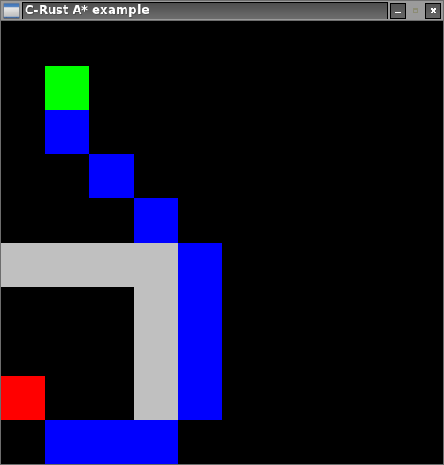

# C Rust A*

A graphical C program showing `A*` paths resolution using a Rust library.

The used Rust library has been developed for the project
and can be found here: https://github.com/jean553/a-star-rs.



## Requirements

The following tools are required:
 * cargo (Rust nightly),
 * gcc

## Install sub-module (Rust A-Star library)

```bash
git submodule init
git submodule update
```

## Compile

The following command compiles both
of the C program and the Rust library.

```sh
make
```

## Run

```sh
./c_rust_a_star 10 10 5 6 12 8
```

The options are (in order):
 * map width (in nodes),
 * map height (in nodes),
 * departure node index,
 * arrival node index
 * walls indices list (optional, here 12 and 8)

## Remove previous compilation data

```sh
make clean
```
